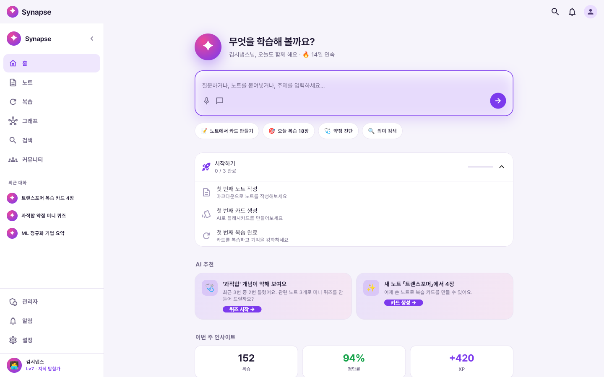
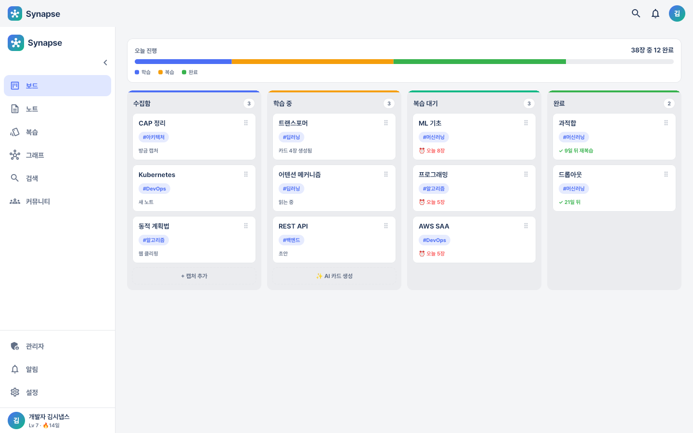
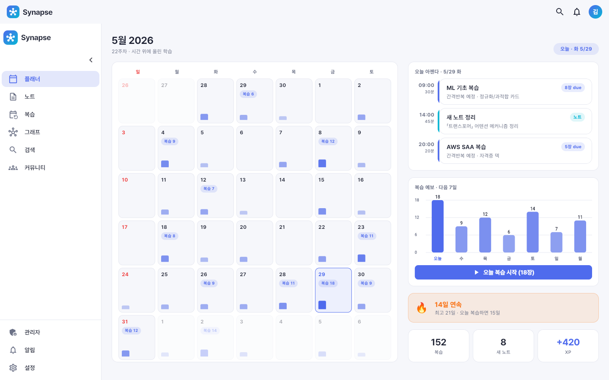
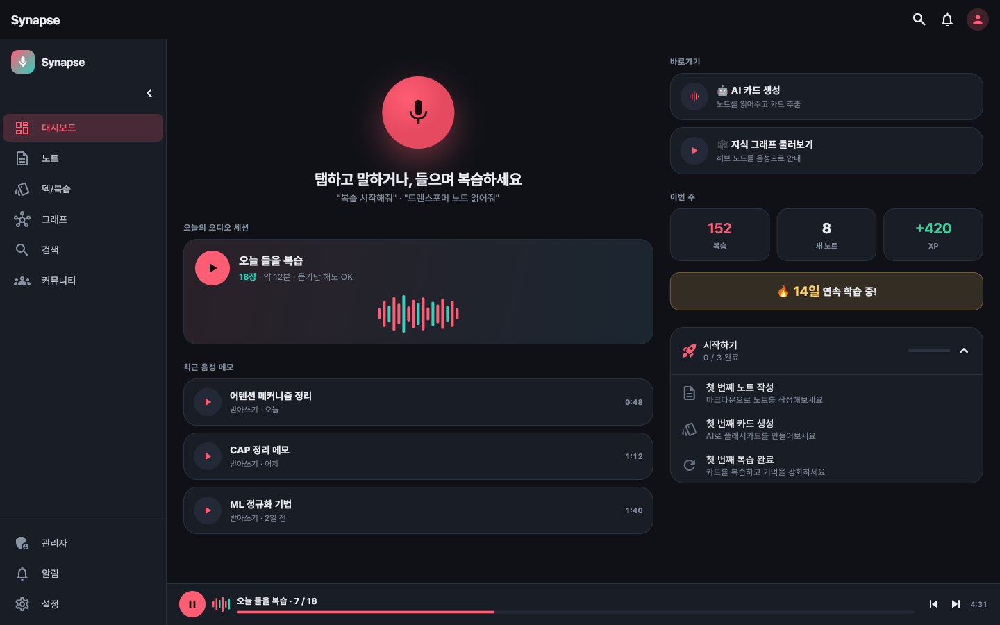
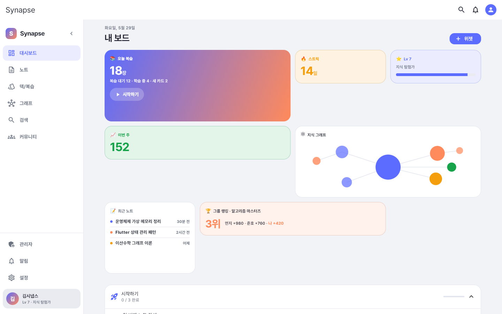
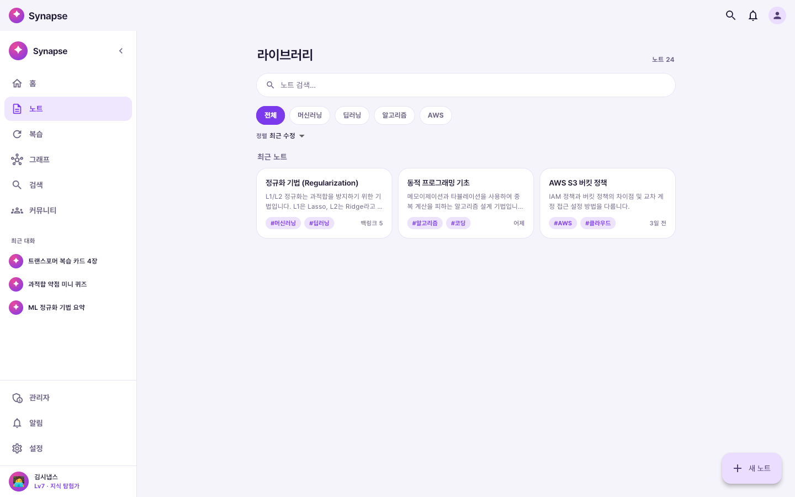
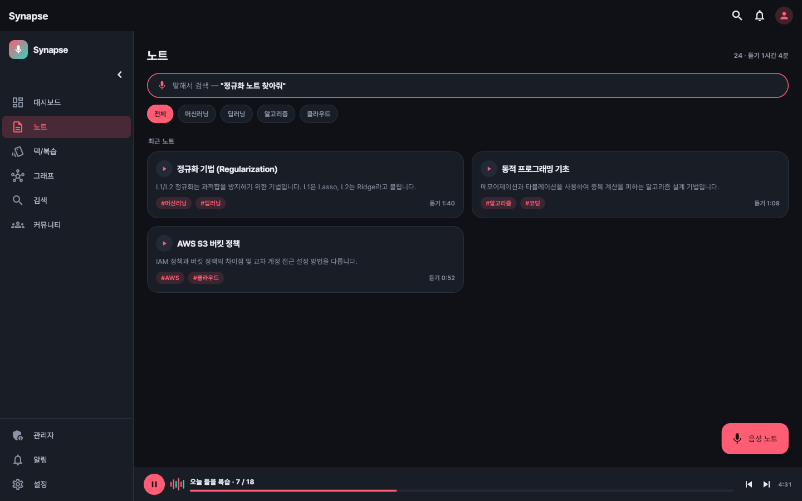

# Synapse · 학습 앱 디자인 컨셉 5종

> 같은 학습 앱(노트 · 복습 · AI · 커뮤니티)을 **5가지 디자인 방향으로 각각 풀구현**한 디자인 탐색 프로젝트입니다.
> Flutter 단일 코드베이스로 웹·모바일 반응형을 모두 지원하며, 디자인 토큰만 교체해 5개 컨셉을 분기했습니다.

### 🔗 라이브 데모 — https://maoemong.github.io/synapse-design-preview/

각 앱 첫 화면에서 **로그인 버튼**만 누르면 들어갑니다 (개발용 바이패스 · 목업 데이터로 동작).
브라우저 창을 좁히거나 휴대폰으로 열면 모바일 레이아웃(하단 탭바)으로 리플로우됩니다.

| 컨셉 | 데모 | 팔레트 | 한 줄 |
|------|------|--------|-------|
| **AI Tutor** | [열기](https://maoemong.github.io/synapse-design-preview/tutor/) | 보라 `#7C3AED` / 핑크 `#EC4899` | 대화형 AI 비서 중심 |
| **Study Board** | [열기](https://maoemong.github.io/synapse-design-preview/board/) | 블루 `#4C6EF5` / 그린 `#12B886` | 칸반 보드 흐름 관리 |
| **플래너** | [열기](https://maoemong.github.io/synapse-design-preview/planner/) | 인디고 `#4F6BED` / 시안 `#06B6D4` | 시간·캘린더 중심 |
| **음성·핸즈프리** | [열기](https://maoemong.github.io/synapse-design-preview/voice/) | 다크 코랄 `#FF5D73` / 틸 `#2DD4BF` | 듣고 말하는 음성 우선 |
| **위젯 대시보드** | [열기](https://maoemong.github.io/synapse-design-preview/widgets/) | 인디고 `#5B6CFF` / 오렌지 `#FF8A5B` | 위젯 타일 보드 |

---

## 미리보기

### 홈 / 대시보드
| AI Tutor | Study Board | 플래너 |
|:--:|:--:|:--:|
|  |  |  |

| 음성·핸즈프리 | 위젯 대시보드 |
|:--:|:--:|
|  |  |

### 노트 (같은 화면, 컨셉별 재해석)
| AI Tutor | 음성·핸즈프리 |
|:--:|:--:|
|  |  |

---

## 컨셉별 특징

- **AI Tutor** — 질문 바가 곧 진입점. AI 추천 카드, 대화형 카드 생성(체크박스+`basic`/`cloze` 배지), 복습 중 단계별 AI 힌트.
- **Study Board** — 수집함 → 학습중 → 복습대기 → 완료의 칸반 흐름. 페이즈 색 스트립, 그룹 상세.
- **플래너** — 월 캘린더(복습 due/부하), 오늘 아젠다 타임블록, SM-2 간격 기반 복습 예보.
- **음성·핸즈프리** — 다크 테마. 오디오 복습 세션(파형+재생 트랜스포트), 음성 받아쓰기, 하단 미니플레이어.
- **위젯 대시보드** — 위젯 타일 보드(데스크탑 4열/모바일 2열), 편집 모드로 타일 추가·재배치.

## 공통 화면

노트 목록/상세(본문 위키링크 `[[…]]` + 백링크) · 노트 편집(마크다운 + `[[` 자동완성 + AI 정리 제안) · AI 카드 생성 · 복습 세션(플래시카드 flip + SRS 평가) · 복습 결과 · 지식 그래프(PageRank 노드 크기 + 태그 색 + AI 허브 분석) · 의미/키워드 검색(AI 답변 + 출처) · 프로필(XP·배지 갤러리) · 커뮤니티(그룹·주간 랭킹) · 설정 · 빌링 · 알림 · 어드민(웹).

## 기술 스택

- **Flutter** (웹/모바일, 단일 코드베이스) · **Dart**
- **Riverpod** (manual providers, codegen 미사용) · **go_router**
- **Dio** (네트워크 레이어) · **Pretendard** 폰트
- 웹 렌더: CanvasKit · 정적 호스팅: GitHub Pages

## 설계 하이라이트

- **디자인 토큰 중앙화** — 색을 `core/theme/app_colors.dart` 토큰으로 모아, 팔레트 교체가 사실상 1파일 수정으로 끝나도록. 미수정 화면도 토큰만으로 컨셉 색을 자동 상속.
- **Port/Adapter 아키텍처** — Screen → Repository(Port) 경유, DTO→Entity 변환, 도메인은 HTTP 라이브러리에 무지. (백엔드 연동 시 어댑터만 교체)
- **반응형** — `width < 600` 기준 데스크탑(사이드바)/모바일(탭바) 분기.
- **품질** — 화면별 위젯 렌더 테스트(데스크탑 1440×900 / 모바일 390×844)로 런타임 레이아웃 예외 0 검증, `flutter analyze` 경고 0.

## 실행

```bash
flutter pub get
flutter run -d chrome          # 로컬 실행
flutter build web --release    # 정적 빌드 (build/web)
```

## 비고

디자인 시안 단계로, **인증·데이터는 목업**입니다(백엔드 연동 전). 화면·인터랙션·반응형·디자인 시스템을 보여주기 위한 프로젝트입니다.
